# A simple DMG (Gameboy) Emulator written in C3

Developed using the [C3 programming language](https://c3-lang.org/). Its main purpose is to get a functional emulator, accurated as possible, that runs, at least, most of the DMG games.
It is programmed using [Raylib](https://www.raylib.com/) to manage the window and the keys.

## Controls
|Emulator|Keyboard|
|--|--|
|A|Z|
|B|X|
|Start|Enter|
|Select|Backspace|
|Up|Arrow Up|
|Down|Arrow Down|
|Left|Arrow Left|
|Right|Arrow Right|

## Features
 - Loads a BIOS an uses it (only 256 Bytes)
 - Able to Run some games
 - Able to Save and Load some games
 - Some support from MCB1,MCB3,MCB5 mappers
 - Debugger (Very simple, pres Esc to enable it on the terminal)

## Compiling and Running

    c3c build
    ./gb path_to_bios.bin path_to_rom.gb

## Known Bugs
 - Pokemon Red JP: Up key not working
 - Pokemon Red JP: Saving does not work
 - Pokemon Red US: Not loading after the initial scene 

## Screenshots
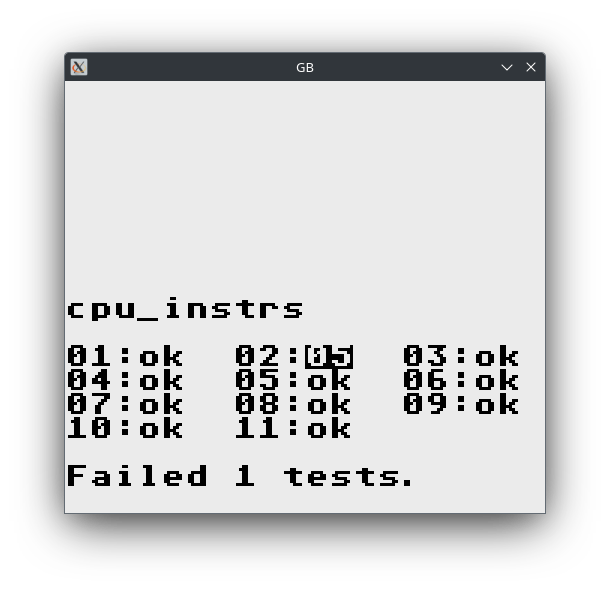
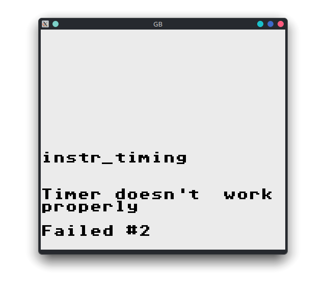
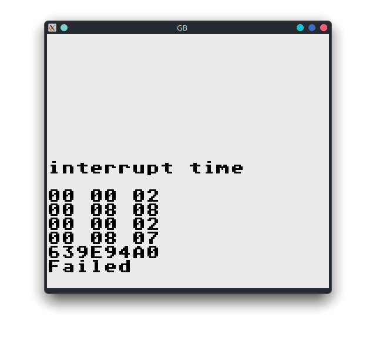
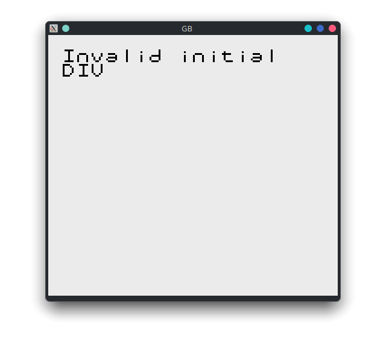
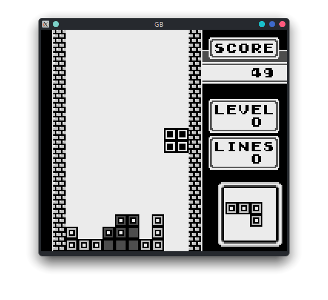
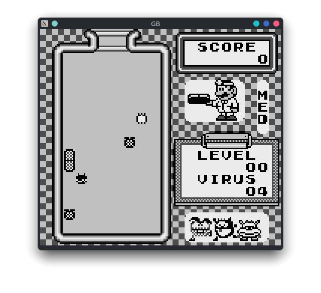
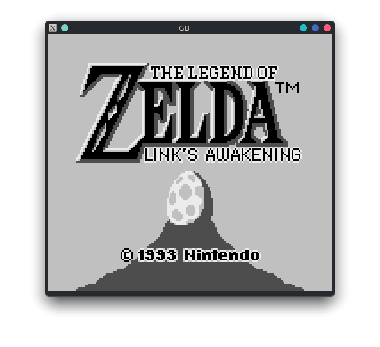
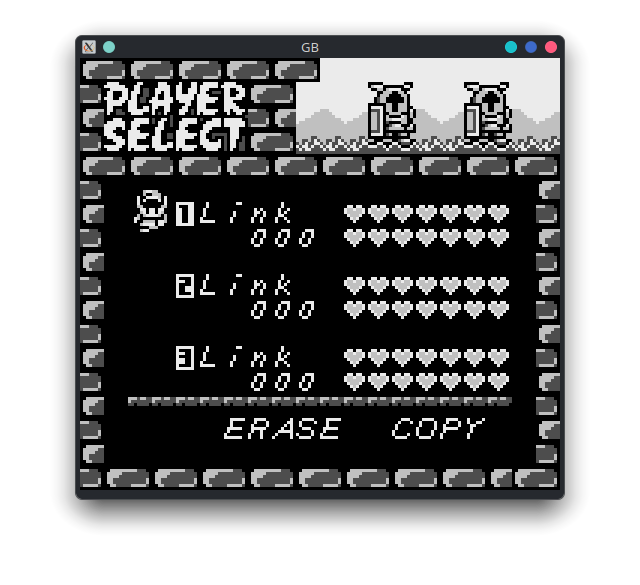
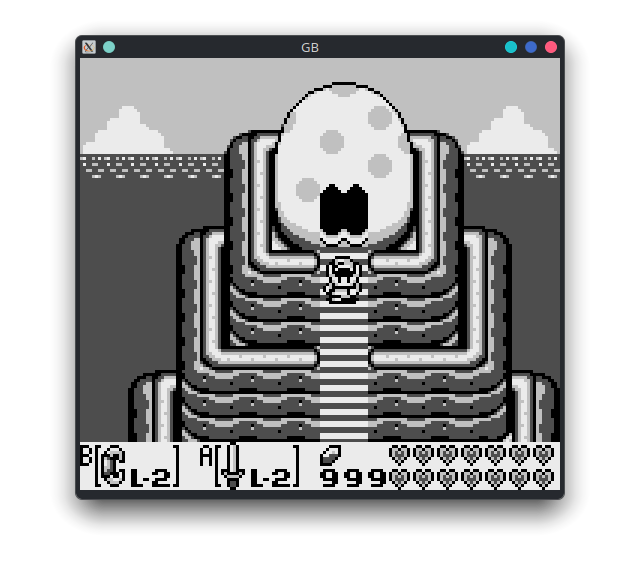
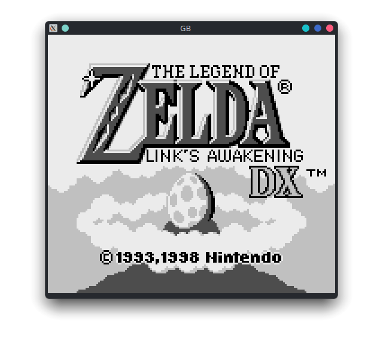
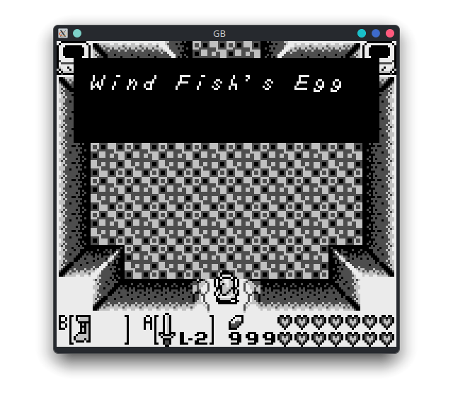
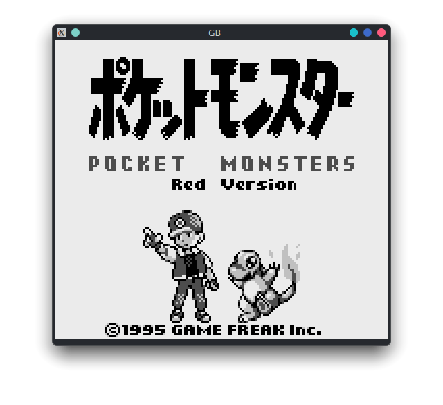
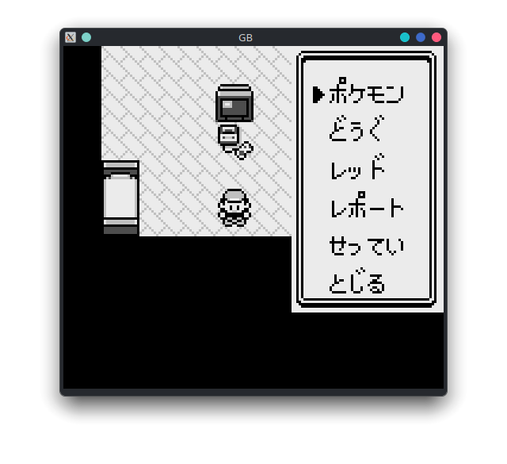
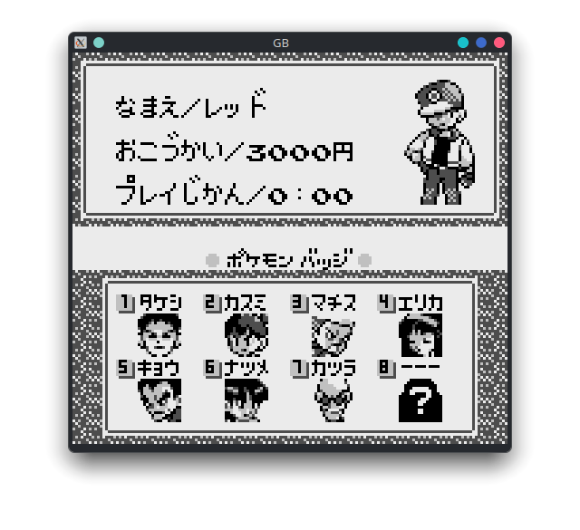

